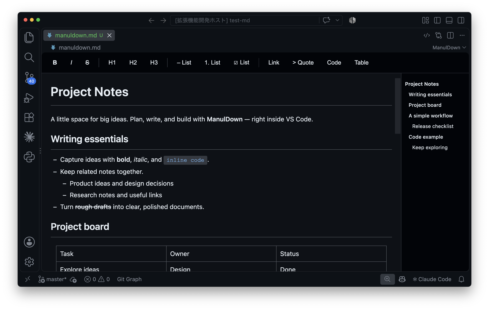

[English](./README.md) / [日本語](./README.ja.md)

# ManulDown for VSCode

ManulDownは、MarkdownファイルをWYSIWYGエディタで編集できるVSCode拡張機能です。



## 主な機能

- **WYSIWYG編集**: 表示結果をリアルタイムで確認しながら編集できます。
- **基本的な書式設定**:
  - 太字（`Ctrl+B` / `Cmd+B`）
  - 斜体（`Ctrl+I` / `Cmd+I`）
  - 取り消し線（`Cmd+Shift+X`）
  - 見出し（H1〜H6）
  - 箇条書き
  - 番号付きリスト
  - コードブロック（シンタックスハイライト付き）
- **Markdown記法の自動変換**: 入力中に `#`、`**`、`*`、`-`、`` ``` `` などの記法を認識します。
- **シンタックスハイライト**: Prism.jsによる複数言語のハイライトに対応しています。
- **画像の挿入**: 画像の貼り付けやドラッグ＆ドロップに対応しています。
- **リンク**: HTTP、HTTPS、メールのリンクや、現在のワークスペースフォルダ内のファイルへの安全にエンコードされたリンクを挿入できます。
- **脚注**: `[^ラベル]` と `[^ラベル]: 注釈` を表示・編集できます。番号と注釈の並びは本文の参照順に揃います。番号のクリックで注釈へ、注釈の「↩」で本文へ移動できます。
- **数式**: TeXの数式を `$…$`（インライン）や `$$…$$`（ブロック）で記入でき、KaTeXで表示します。詳しくは[数式](#数式)を参照してください。
- **目次**: 見出しから自動生成します。
- **双方向の同期**: エディタでの変更をMarkdownファイルに即座に反映します。
- **ツールバー**: よく使う書式をボタンからすばやく設定できます。
- **元に戻す・やり直し**: 編集履歴に対応しています。

## 使い方

1. Markdownファイル（`.md`）を開きます。
2. ファイルを右クリックして `Open with ManulDown Editor` を選択します。

- コマンドパレット（`Ctrl+Shift+P` / `Cmd+Shift+P`）から `ManulDown: Open with ManulDown Editor` を実行することもできます。

3. WYSIWYGエディタで編集を始めます。

### Markdown原文の保持

ファイルを開くだけでは原文を変更しません。編集時も、変更していないブロックとインライン書式は、アンダースコアによる強調、リストのマーカー、コードフェンス、リンク、表の空白、空行などの元の記法を保持します。変更したブロックは、意味を保つために必要なエスケープを付けて書き出します。脚注は画面では参照順に表示しますが、既存の定義は原文の順序を保持します。

`[!NOTE]` などのGitHubアラートのマーカーは、読み取り専用の原文として表示・保持します。フロントマター、raw HTML、参照定義も原文を保持します。

### ツールバーのボタン

- **B**: 太字
- **I**: 斜体
- **&lt;/&gt;**: 選択したテキストのインラインコード化・解除。未選択の場合は入力用のコードを挿入し、コード内ではコードの書式を解除します。
- **H1, H2, H3**: 見出しレベル
- **• / 1. / ☑**: 箇条書き、番号付きリスト、タスクリスト。各ボタンにマウスを合わせると名前を表示します。
- **Link**: URL、ワークスペース内の絶対パス、ワークスペース内のファイル検索に使うインラインのリンク入力欄を開きます。
- **Footnote**: カーソル位置（選択中は選択範囲の末尾）に脚注を追加し、文書末尾の注釈へカーソルを移します。

注釈の本文は直接編集できます。注釈にマウスを合わせると右端に「×」が表示され、押すとその注釈と対応する参照をまとめて削除します。追加・編集・削除はUndo/Redoに対応しています。
本文の参照番号をBackspaceやDeleteで消すと、その参照だけを削除します。最後の参照を消した場合は、対応する注釈も削除します。
脚注付きの本文をコピー・移動すると、対応する注釈も保持されます。脚注内でも文書全体の参照形式リンク・画像を使用できます。入れ子の脚注定義は4段まで編集でき、それより深い定義は原文として読み取り専用で保持します。
- **Code**: コードブロックを挿入します。
- **Math** / **Math Block**（**…** メニュー内）: インライン数式または数式ブロックを挿入します。テキストを選択してMathを押すと、選択範囲を数式にします。
- **Image**: 画像ファイルを選び、文書の画像フォルダへコピーして元の選択位置に挿入します。ImageとLinkは左揃えのツールバーの末尾に並べています。

エディターの幅が狭いときは、収まらないボタンを **…** メニューに表示します。幅を広げるとツールバーへ戻ります。メニューは矢印キーで移動でき、Escapeで閉じられます。

テキストを選択して、Linkボタン、`/link`、`Cmd+K`、`Ctrl+K` のいずれかを使うと、既存のリンクの編集と共通のインラインポップオーバーが開きます。HTTP、HTTPS、`mailto:` のURLを直接貼り付けるか、現在のワークスペース内に存在するファイルの絶対パス、または `./` / `../` で始まる相対パスを貼り付けてください。`test3` のように2文字以上入力すると、入力欄の下に一致するワークスペース内のファイルが表示されます。候補を選択すると相対パスが入力されるので、**Apply** またはEnterで確定します。絶対パスは相対パスのMarkdownリンクとして保存されます。

選択したテキストにローカルの絶対パスを直接貼り付けても、相対リンクを作成できます。無効なパス、存在しないファイル、シンボリックリンク、リモートの対象、ワークスペース外の対象は、通常のプレーンテキストとして貼り付けられます。

リンク内にカーソルを置き、macOSでは `Cmd+Enter`、Windows/Linuxでは `Ctrl+Enter` を押すと、リンク先のURL、ワークスペース内のファイル、現在の文書内の見出しを開きます。`Cmd+Click` / `Ctrl+Click` でもリンクを開けます。

### 数式

数式はTeXの記法で書き、[KaTeX](https://katex.org/supported.html)で表示します。KaTeXは数式を含む文書でのみ読み込みます。

- **インライン数式**: `$E = mc^2$` と入力すると、閉じる `$` を入力した時点で数式になります。ファイルを開いた時と同じく、TeXの先頭と末尾には空白を置けないため、`$5 and $10` は文字のままです。数式をクリックする（または選択してEnterを押す）と、小さな入力欄でTeXを編集できます。入力に合わせて数式が更新され、TeXの誤りは入力欄の下に表示されます。Enterで確定し、Escapeで元のTeXに戻します。数式の手前で右矢印、直後で左矢印を押すと数式全体を選択し、Enterで編集を開きます。選択中にもう一度矢印キーを押すと、その方向の隣へ移動します。BackspaceやDeleteで数式を削除できます。
- **数式ブロック**: 空の行で `$$` と入力してEnterを押すか、`/math` または **Math Block** を使います。数式ブロックはコードブロックと同じように編集でき、**TeX** ではソースとその下に数式を、**Preview** では数式だけを表示します。表示中の数式をクリックするとTeXを編集できます。```` ```math ```` のフェンスも同じように表示し、コードブロックの言語に `math` を選ぶと数式ブロックになります。

数式は `$…$` と `$$` のブロックとして保存します。変更していない数式は元の記法を保持します。空行を含むなど `$$` で囲めないTeXは、代わりに ```` ```math ```` のフェンスとして保存します。

### スラッシュコマンド

エディタで `/` を入力すると、スラッシュコマンドのメニューが開きます。`/ta` のように入力すると候補を絞り込めます。

| コマンド | 動作 |
| --- | --- |
| `/link` | インラインのリンク入力欄を開き、URLまたはワークスペース内のリンクを挿入します |
| `/toc` | 現在の文書の見出しへのリンクを、階層付きリストとして挿入します |
| `/footnote` | 脚注を追加し、注釈の編集へ移ります |
| `/table` | 2×2の表を挿入します |
| `/quote` | 現在のブロックを引用に変換します（変換できない場合は空の引用ブロックを挿入します） |
| `/code` | コードブロックを挿入し、編集用に言語ラベルへフォーカスを移します |
| `/math` | 数式ブロック（`$$…$$`）を挿入し、TeXの編集へ移ります |
| `/inline-math` | インライン数式（`$…$`）を挿入し、編集欄を開きます |
| `/checkbox` | チェックリスト項目（タスクリスト）を作成します |

カスタムスラッシュコマンド:

`~/.manuldown` に `.md` ファイルを置くと、各ファイルがファイル名に基づくスラッシュコマンドになります。
たとえば、`~/.manuldown/meeting-minutes.md` の内容は、`/meeting-minutes` で現在のカーソル位置に挿入できます。

- コマンド名はファイル名から `.md` を除いたものです。
- コマンドを実行すると、ファイルの内容をカーソル位置に挿入します。
- ユーザー定義のコマンドは、スラッシュメニュー内で緑色で表示されます。

カスタムコマンド名について:

- コマンドIDはファイル名から正規化されます（空白を `-` に変換、先頭の `/` を削除、小文字に変換）。
- 組み込みコマンドのID（`link`、`toc`、`footnote`、`table`、`quote`、`code`、`math`、`inline-math`、`checkbox`）は予約されています。
- 正規化後のコマンドIDが重複する場合は無視されます。

メニューの操作:

- `Enter`: 選択中のコマンドを実行
- `Tab` / `Shift+Tab`: 次／前のコマンドへ移動
- `ArrowUp` / `ArrowDown`: 前／次のコマンドへ移動（macOSでは `Ctrl+P` / `Ctrl+N` も使用できます）
- `Esc`: メニューを閉じる

補足:

- スラッシュコマンドは通常のテキスト入力時に使用できます。コードブロック内、表のセル内、IMEでの文字変換中にはメニューは表示されません。
- `/toc` は、その時点の見出しをもとにした目次を現在のカーソル位置に挿入します。見出しを変更した後は再度実行すると、更新された目次を挿入できます。見出しがない文書ではリストは生成されません。

### キーボードショートカット

#### 書式設定

| 操作 | Mac | Windows / Linux |
| --- | --- | --- |
| 太字 | `Cmd+B` | `Ctrl+B` |
| 斜体 | `Cmd+I` | `Ctrl+I` |
| 取り消し線 | `Cmd+Shift+X` | `Alt+Shift+5` |

#### 編集

| 操作 | Mac | Windows / Linux |
| --- | --- | --- |
| リンクを挿入 | `Cmd+K` | `Ctrl+K` |
| カーソル位置のリンクを開く | `Cmd+Enter` | `Ctrl+Enter` |
| 元に戻す | `Cmd+Z` | `Ctrl+Z` |
| やり直し | `Cmd+Shift+Z` | `Ctrl+Shift+Z` |
| 検索 | `Cmd+F` | `Ctrl+F` |
| 次の検索結果へ移動 | `Enter` | `Enter` |
| 前の検索結果へ移動 | `Shift+Enter` | `Shift+Enter` |
| 画像の端にあるカーソルから画像を選択 | `ArrowLeft` / `ArrowRight` | `ArrowLeft` / `ArrowRight` |
| 選択中の画像を縮小 | `Shift+ArrowDown` | `Shift+ArrowDown` |
| 選択中の画像を拡大 | `Shift+ArrowUp` | `Shift+ArrowUp` |
| エディタを切り替え | `Cmd+Option+M` | `Ctrl+Alt+M` |

画像のサイズを変更するには、画像の左端または右端にカーソルを置き、`ArrowLeft` / `ArrowRight` で画像を選択してから、`Shift+ArrowUp` または `Shift+ArrowDown` を使います。

#### 表の操作

| 操作 | Mac | Windows / Linux |
| --- | --- | --- |
| 行／列を挿入 | `Cmd+Ctrl+Shift+Up/Down/Left/Right` | `Ctrl+Shift+Alt+Up/Down/Left/Right` |
| 現在の列を選択 | `Ctrl+Shift+Option+Up/Down` | `Ctrl+Alt+Up/Down` |
| 現在の行を選択 | `Ctrl+Shift+Option+Left/Right` | `Ctrl+Alt+Left/Right` |
| 選択中の列／行を移動 | `Shift+Left/Right`（列）、`Shift+Up/Down`（行） | `Shift+Left/Right`（列）、`Shift+Up/Down`（行） |

#### Emacsキーバインド（macOSのみ）

ManulDownは、macOS標準のEmacs形式のキーバインドに対応しています。Windows/Linuxでは無効です。

| 操作 | キー |
| --- | --- |
| カーソルを上へ移動 | `Ctrl+P` |
| カーソルを下へ移動 | `Ctrl+N` |
| カーソルを左へ移動 | `Ctrl+B` |
| カーソルを右へ移動 | `Ctrl+F` |
| 行の先頭へ移動 | `Ctrl+A` |
| 行の末尾へ移動 | `Ctrl+E` |
| 行／リスト項目を削除 | `Ctrl+K` |
| 最後に `Ctrl+K` で削除したテキストを貼り付け | `Ctrl+Y` |
| カーソルの前の1文字を削除 | `Ctrl+H` |

### 設定

VSCodeの設定（`Ctrl+,` / `Cmd+,`）で、以下のオプションを変更できます。

| 設定 | 既定値 | 説明 |
| --- | --- | --- |
| `manulDown.toolbar.visible` | `true` | ツールバーを表示します |
| `manulDown.toc.enabled` | `true` | 見出しがある場合に目次を自動表示します |
| `manulDown.openByDefault` | `true` | Markdownファイルを既定でManulDownで開きます（`workbench.editorAssociations` を即座に更新します） |
| `manulDown.editor.theme` | `"vscode"` | エディタのテーマ: `"vscode"`（VSCodeに合わせる）、`"light"`、`"dark"` |
| `manulDown.list.dashStyle` | `false` | 箇条書きのマーカーに `-` を使用します |
| `manulDown.list.indentSize` | `2` | 文書のスタイルを検出できない場合の、入れ子のリストの既定インデント幅（`2` または `4` スペース） |
| `manulDown.security.allowRemoteImages` | `false` | リモートのhttp/https画像をエディタ内で読み込めるようにします |
| `manulDown.security.allowRemoteImageImport` | `false` | 貼り付けまたはドロップしたリモートのhttp/https画像URLから、ワークスペースへ画像をダウンロードできるようにします |
| `manulDown.security.allowFileLinks` | `false` | エディタから `file://` リンクを開けるようにします |

セキュリティに関する注意:

`manulDown.security.*` のオプションは既定で無効です。有効にすると、Markdown文書によって外部へのネットワークリクエストが発生したり、外部からファイルがダウンロードされたり、IPアドレスやアクセス時刻などのネットワーク情報が送信されたりする可能性があります。また、ファイル、アプリケーション、ショートカット、Windowsのネットワーク共有など、ローカルの `file://` リンク先が開かれる可能性もあります。開くMarkdownファイルを信頼できる場合にのみ有効にしてください。

リンクの選択処理は、リンクコマンドを呼び出した後にのみ実行されます。インラインのURL／パス入力欄に入力したテキストは、検証のためにVSCodeの拡張機能ホストへ送信されます。ワークスペース内のファイル探索はホスト側で行われ、編集中の文書にはサイズ制限のある表示ラベルと候補の相対パスのみが渡されます。候補の選択は有効期間の短い不透明なIDで解決され、挿入前に再検証されます。新しい外部リンクはHTTP、HTTPS、`mailto:` のURLに限定され、リンク作成中にManulDownがリンク先へアクセスしたり開いたりすることはありません。貼り付けた絶対パスや明示的な相対パスは、現在の文書が属するワークスペース内の実在する、シンボリックリンクではないファイルに限り受け付けられ、エンコードされた相対パスに変換されます。受け付けられなかった絶対パスは、ワークスペース外を調べることなくプレーンテキストとして貼り付けられます。ワークスペース内のリンクは相対パスのまま保持され、現在のワークスペースフォルダ外を指すリンクは、`manulDown.security.allowFileLinks` が有効な場合を除きブロックされます。

### Markdown記法

エディタは以下のMarkdownパターンを自動変換します。

- `# 見出し` → 見出し1
- `## 見出し` → 見出し2
- `### 見出し` → 見出し3
- `**テキスト**` → **太字**
- `*テキスト*` → *斜体*
- `- 項目` → 箇条書き
- `1. 項目` → 番号付きリスト
- `` ```javascript `` → コードブロック（`` ``` `` の後に言語を入力し、`Enter` を押します）
- `$TeX$` → インライン数式
- `$$` → 数式ブロック（`$$` だけの行で `Enter` を押します）

## 開発

### プロジェクト構成

```
manuldown/
|-- src/
|   |-- extension.ts              # 拡張機能のエントリーポイント
|   |-- editor/
|   |   |-- MarkdownEditorProvider.ts  # カスタムエディタのプロバイダー
|   |   `-- MarkdownDocument.ts        # Markdown文書の処理
|   `-- utils/
|       `-- getNonce.ts           # セキュリティ用ユーティリティ
|-- media/
|   |-- editor.js                 # Webviewのエントリーポイント
|   |-- editor.css                # エディタのスタイル
|   `-- modules/                  # 機能別のWebviewモジュール
|       |-- CodeBlockManager.js
|       |-- CursorManager.js
|       |-- DOMUtils.js
|       |-- ListManager.js
|       |-- MarkdownConverter.js
|       |-- MathManager.js
|       |-- SearchManager.js
|       |-- StateManager.js
|       |-- TableManager.js
|       |-- TableOfContentsManager.js
|       `-- ToolbarManager.js
|-- images/                       # README／ドキュメント用の画像
|-- out/                          # コンパイル済みの出力
|-- README.md                     # 英語版の概要
|-- README.ja.md                  # 日本語版の概要
|-- USAGE.md                      # 詳細な使い方
|-- package.json                  # 拡張機能のマニフェスト
`-- tsconfig.json                 # TypeScriptの設定
```

### ビルドコマンド

- `npm run compile`: TypeScriptをコンパイルします。
- `npm run watch`: ファイルの変更時にコンパイルします。
- `npm run lint`: lintチェックを実行します。

## 使用技術

- **TypeScript**: 型安全な開発
- **VSCode Extension API**: 拡張機能のプラットフォーム
- **Custom Editor API**: カスタムエディタの実装
- **Webview API**: エディタUIの描画
- **marked**: MarkdownからHTMLへの変換
- **turndown**: HTMLからMarkdownへの変換
- **Prism.js**: シンタックスハイライト
- **KaTeX**: 数式の表示
- **contenteditable**: WYSIWYG編集

## ライセンス

MIT
