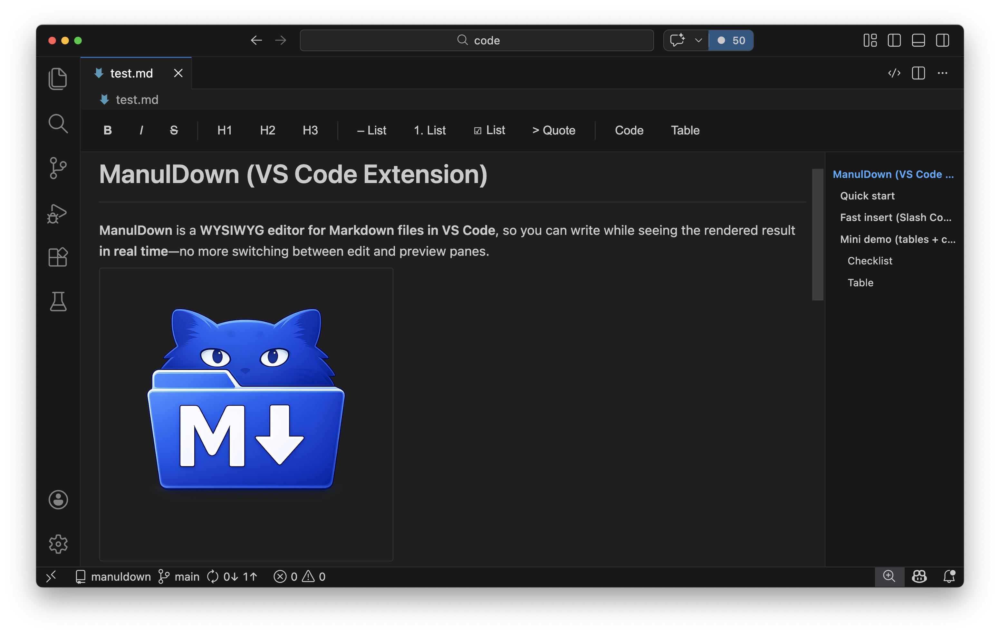

# ManulDown for VSCode

ManulDown is a VSCode extension that lets you edit Markdown files in a WYSIWYG editor.

  

## Features

- **WYSIWYG editing**: Edit while previewing the rendered result in real time.
- **Core formatting**:
  - Bold (`Ctrl+B` / `Cmd+B`)
  - Italic (`Ctrl+I` / `Cmd+I`)
  - Strikethrough (`Cmd+Shift+X`)
  - Headings (H1-H6)
  - Unordered lists
  - Ordered lists
  - Code blocks (with syntax highlighting)
- **Automatic Markdown syntax conversion**: Recognizes syntax such as `#`, `**`, `*`, `-`, and `` ``` `` while typing.
- **Syntax highlighting**: Multi-language highlighting powered by Prism.js.
- **Image support**: Paste and drag-and-drop images.
- **Table of contents**: Auto-generated from headings.
- **Two-way sync**: Changes in the editor are reflected in the Markdown file immediately.
- **Toolbar**: Quick access buttons for common formatting.
- **Undo/Redo**: Edit history support.

## Usage

1. Open a Markdown file (`.md`).
2. Right-click the file and choose `Open with ManulDown Editor`.

- Or run `ManulDown: Open with ManulDown Editor` from the command palette (`Ctrl+Shift+P` / `Cmd+Shift+P`).

3. Start editing in the WYSIWYG editor.

### Toolbar Buttons

- **B**: Bold
- **I**: Italic
- **H1, H2, H3**: Heading levels
- **• List**: Unordered list
- **1\. List**: Ordered list

### Slash Commands

Type `/` in the editor to open the slash command menu. You can narrow results by typing a prefix such as `/ta`.

| Command | Action |
| --- | --- |
| `/table` | Insert a 2x2 table |
| `/quote` | Convert the current block into a quote (or insert an empty quote block if conversion is not possible) |
| `/code` | Insert a code block and focus the language label for editing |
| `/checkbox` | Create a checklist item (task list) |

Custom slash commands:

Drop .md files into ~/.manuldown, and each file becomes a slash command based on its filename.
For example, ~/.manuldown/meeting-minutes.md can be inserted with /meeting-minutes at the current cursor position.
- The command name is the filename without .md
- Running the command inserts the file contents at the cursor
- User-defined commands appear in green in the slash menu

Notes for custom command names:

- Command IDs are normalized from file names (`spaces` -> `-`, leading `/` removed, lowercase).
- Built-in command IDs (`table`, `quote`, `code`, `checkbox`) are reserved.
- Duplicate normalized command IDs are ignored.

Menu controls:

- `Enter`: Run the selected command
- `Tab` / `Shift+Tab`: Move to next/previous command
- `ArrowUp` / `ArrowDown`: Move to previous/next command (`Ctrl+P` / `Ctrl+N` also work on macOS)
- `Esc`: Close the menu

Notes:

- Slash commands are available in normal text input context. The menu does not appear inside code blocks, inside table cells, or during IME composition.

### Keyboard Shortcuts

#### Formatting

| Action | Mac | Windows / Linux |
| --- | --- | --- |
| Bold | `Cmd+B` | `Ctrl+B` |
| Italic | `Cmd+I` | `Ctrl+I` |
| Strikethrough | `Cmd+Shift+X` | `Alt+Shift+5` |

#### Editing

| Action | Mac | Windows / Linux |
| --- | --- | --- |
| Undo | `Cmd+Z` | `Ctrl+Z` |
| Redo | `Cmd+Shift+Z` | `Ctrl+Shift+Z` |
| Find | `Cmd+F` | `Ctrl+F` |
| Find next match | `Enter` | `Enter` |
| Find previous match | `Shift+Enter` | `Shift+Enter` |
| Select image from image edge caret | `ArrowLeft` / `ArrowRight` | `ArrowLeft` / `ArrowRight` |
| Resize selected image smaller | `Shift+ArrowDown` | `Shift+ArrowDown` |
| Resize selected image larger | `Shift+ArrowUp` | `Shift+ArrowUp` |
| Toggle editor | `Cmd+Option+M` | `Ctrl+Alt+M` |

Image resize flow: place the caret on the left or right edge of an image, press `ArrowLeft` / `ArrowRight` to select the image, then use `Shift+ArrowUp` or `Shift+ArrowDown`.

#### Table Operations

| Action | Mac | Windows / Linux |
| --- | --- | --- |
| Insert row/column | `Cmd+Ctrl+Shift+Up/Down/Left/Right` | `Ctrl+Shift+Alt+Up/Down/Left/Right` |
| Select current column | `Ctrl+Shift+Option+Up/Down` | `Ctrl+Alt+Up/Down` |
| Select current row | `Ctrl+Shift+Option+Left/Right` | `Ctrl+Alt+Left/Right` |
| Move selected column / row | `Shift+Left/Right` (column), `Shift+Up/Down` (row) | `Shift+Left/Right` (column), `Shift+Up/Down` (row) |

#### Emacs Keybindings (macOS only)

ManulDown supports standard macOS-style Emacs keybindings. These are disabled on Windows/Linux.

| Action | Key |
| --- | --- |
| Move cursor up | `Ctrl+P` |
| Move cursor down | `Ctrl+N` |
| Move cursor left | `Ctrl+B` |
| Move cursor right | `Ctrl+F` |
| Move to beginning of line | `Ctrl+A` |
| Move to end of line | `Ctrl+E` |
| Delete line/list item | `Ctrl+K` |
| Yank last `Ctrl+K` text | `Ctrl+Y` |
| Delete backward one character | `Ctrl+H` |

### Settings

You can change the following options from VSCode settings (`Ctrl+,` / `Cmd+,`):

| Setting | Default | Description |
| --- | --- | --- |
| `manulDown.toolbar.visible` | `true` | Show the toolbar |
| `manulDown.toc.enabled` | `true` | Automatically show the table of contents when headings exist |
| `manulDown.toc.scrollDuration` | `120` | TOC click scroll duration in ms (`0` for instant jump) |
| `manulDown.openByDefault` | `true` | Open Markdown files with ManulDown by default (updates `workbench.editorAssociations` immediately) |
| `manulDown.keepTabOpenOnExplorerClick` | `true` | Keep ManulDown tabs open when opening Markdown from Explorer (prevents preview-tab replacement) |
| `manulDown.list.dashStyle` | `false` | Use `-` as the bullet marker style |

### Markdown Syntax

The editor automatically converts the following Markdown patterns:

- `# Heading` -> Heading 1
- `## Heading` -> Heading 2
- `### Heading` -> Heading 3
- `**text**` -> **bold**
- `*text*` -> *italic*
- `- item` -> Unordered list
- `1. item` -> Ordered list
- `` ```javascript `` -> Code block (type a language after `` ``` `` and press `Enter`)

## Development

### Project Structure

```
manuldown/
|-- src/
|   |-- extension.ts              # Extension entry point
|   |-- editor/
|   |   |-- MarkdownEditorProvider.ts  # Custom editor provider
|   |   `-- MarkdownDocument.ts        # Markdown document handling
|   `-- utils/
|       `-- getNonce.ts           # Security utility
|-- media/
|   |-- editor.js                 # Webview entry point
|   |-- editor.css                # Editor styles
|   `-- modules/                  # Modularized webview features
|       |-- CodeBlockManager.js
|       |-- CursorManager.js
|       |-- DOMUtils.js
|       |-- ListManager.js
|       |-- MarkdownConverter.js
|       |-- SearchManager.js
|       |-- StateManager.js
|       |-- TableManager.js
|       |-- TableOfContentsManager.js
|       `-- ToolbarManager.js
|-- images/                       # README/document images
|-- out/                          # Compiled output
|-- README.md                     # Overview
|-- USAGE.md                      # Detailed usage guide
|-- package.json                  # Extension manifest
`-- tsconfig.json                 # TypeScript config
```

### Build Commands

- `npm run compile`: Compile TypeScript
- `npm run watch`: Compile on file changes
- `npm run lint`: Run lint checks

## Tech Stack

- **TypeScript**: Type-safe development
- **VSCode Extension API**: Extension platform
- **Custom Editor API**: Custom editor implementation
- **Webview API**: Editor UI rendering
- **marked**: Markdown-to-HTML conversion
- **turndown**: HTML-to-Markdown conversion
- **Prism.js**: Syntax highlighting
- **contenteditable**: WYSIWYG editing behavior

## License

MIT
